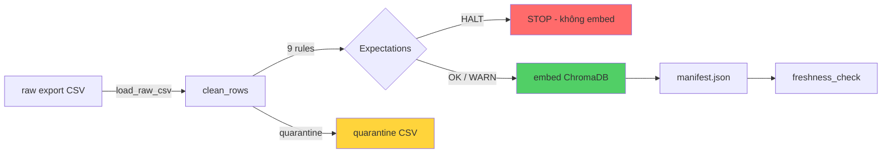

# Kiến trúc pipeline — Lab Day 10

**Nhóm:** Antigravity (Demo Group)  
**Cập nhật:** 15/04/2026

---

## 1. Sơ đồ luồng

> Điểm đo **freshness**: sau khi ghi manifest (`artifacts/manifests/`).  
> **run_id** ghi trong log (`artifacts/logs/`) và manifest JSON.  
> File **quarantine**: `artifacts/quarantine/quarantine_{run_id}.csv`.

---

## 2. Ranh giới trách nhiệm

| Thành phần | Input | Output | Owner nhóm |
|------------|-------|--------|------------|
| Ingest | `data/raw/policy_export_dirty.csv` | List[Dict] raw rows | Trịnh Kế Tiến |
| Transform | Raw rows | 6 cleaned + 4 quarantine | Member 2 (R7–R9) |
| Quality | Cleaned rows | 8 expectation results (OK/FAIL) | Member 3 (E7–E8) |
| Embed | Cleaned CSV | ChromaDB `day10_kb` (6 vectors) | Trịnh Kế Tiến |
| Monitor | Manifest JSON | PASS/WARN/FAIL freshness | Member 5 |

---

## 3. Idempotency & rerun

Pipeline sử dụng **upsert** theo `chunk_id` (SHA256 hash). Chạy lại 2 lần KHÔNG tạo duplicate vectors. Baseline có tính năng **prune**: xóa vector cũ không còn trong batch cleaned hiện tại (`embed_prune_removed` trong log). Rerun an toàn — collection luôn là snapshot của lần publish mới nhất.

---

## 4. Liên hệ Day 09

Pipeline cung cấp collection `day10_kb` trong ChromaDB — cùng engine embedding `all-MiniLM-L6-v2`. Retrieval Worker của Day 09 có thể query trực tiếp collection này. Dữ liệu canonical nằm trong `data/docs/` (5 file .txt) — giống corpus Day 08/09 nhưng được chuẩn hóa thêm qua ETL.

---

## 5. Rủi ro đã biết

- Freshness SLA luôn FAIL trên data mẫu (exported_at cách 120h). Production cần cronjob refresh.
- Prune thủ công: nếu chunk bị xóa khỏi source nhưng không chạy pipeline, vector cũ vẫn tồn tại.
- Console Windows cp1258 không hỗ trợ Unicode đầy đủ → đã fix bằng ASCII log messages.
